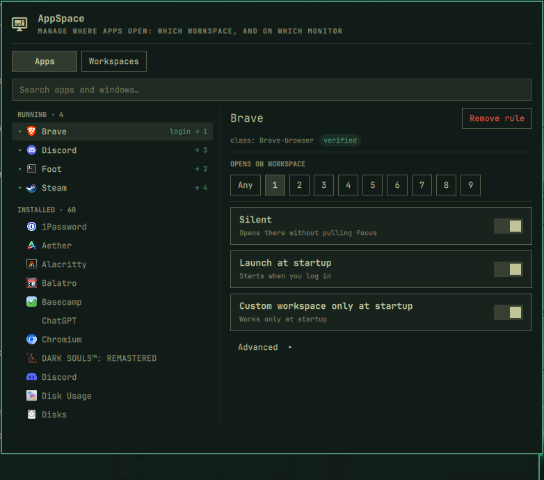

# App workspaces



An Omarchy bar widget that assigns applications to workspaces, and workspaces to
monitors, without hand-editing the Hyprland config.

Click the grid icon on the bar. Pick an app on the left, click a workspace on the
right — that's the whole interaction. The rule is written, Hyprland is reloaded,
and if the app is already running its window moves there immediately.

## Two views

**Apps** — every running window and every installed application, searchable.
A dot marks what is currently running. Assign a workspace, toggle *Silent* and
*Launch at startup*, remove the rule.

**Workspaces** — one row per workspace: which monitor it lives on, which apps are
pinned to it, and whether it is always present. `+ Add workspace` creates the next
free one.

Switch with the tabs or `Ctrl+Tab`.

## How it works

`~/.local/state/omarchy/appws/rules.json` is the single source of truth. From it
the plugin generates `~/.config/hypr/appws.lua`, which is overwritten in full —
never edit that file by hand. The plugin never reads the Lua back.

Window classes come from `Hyprland.toplevels`, i.e. from live windows. That is
deliberate: `StartupWMClass` in `.desktop` files is missing on roughly two thirds
of entries, and wrong on some of the rest — on this machine `brave-browser.desktop`
declares `brave-browser` while the window is actually `Brave-browser`. Rows are
therefore merged case-insensitively, and a live window's spelling always wins,
because that is the string Hyprland compares against.

Rules derived from a `.desktop` file are labelled **guessed class** until a real
window confirms them. **verified** means the class came from a live window or from
a `StartupWMClass` that matches one. Confirmation is sticky: once a window has
proved a class, the rule stays verified after the app closes, and a rule whose
class no window ever used is called out as one that can never fire.

Steam is a special case worth knowing about. It writes one `.desktop` per game
with no `StartupWMClass` and a launcher `Exec`, so the plugin reads the game id
out of `steam://rungameid/<id>` and guesses `steam_app_<id>` — right for XWayland
games, wrong for native Wayland ones (Factorio actually opens as
`com.factorio.Factorio`). While a game runs, the plugin reads `SteamAppId` from
the process environment, learns which class the launcher entry really opens, and
records that alias, so the launcher entry and the real window collapse into one
row from then on.

Monitors are matched by `desc:` (make, model and serial), not by connector, so
moving a cable to another port keeps the layout.

*Launch at startup* rides on the rule, so an app is only launched into a
workspace you have already chosen for it. The generated Lua registers it through
`o.launch_on_start`, which hooks Hyprland's `hyprland.start` event — a config
reload does not re-fire it, so reloading never relaunches your apps. The launch
target is the Desktop Entry ID rather than a resolved command line, because
`uwsm-app` resolves entries itself and gets the `.desktop` field codes right. An
app with no desktop entry has nothing to launch, so the toggle stays inert for
it.

## Install

```sh
omarchy plugin add https://github.com/DominikZajac/omarchy-appws.git --enable
```

Enabling puts the grid icon in the bar's right section. Move it with
`omarchy bar move dominikzajac.appws --section center` if you prefer it elsewhere.

Then wire the generated module into `~/.config/hypr/hyprland.lua`, after the
other `require` lines:

```lua
require("hypr.appws")  -- generated by the dominikzajac.appws plugin
```

The plugin writes an empty `~/.config/hypr/appws.lua` the moment the widget
loads, so the module already exists by the time Hyprland looks for it.

After editing plugin code, run `omarchy restart shell`. Saving a file only
refreshes the plugin registry — a mounted widget keeps running the old code.

## Keyboard

| Key | |
|---|---|
| type | filter the app list |
| `↑` `↓` | move through the list |
| `Tab` / `Shift+Tab` | walk the controls: tabs, workspace chips, monitor dropdowns, buttons |
| `←` `→` | move inside a chip group |
| `Enter` / `Space` | activate the focused control |
| `Ctrl+Tab` | switch between Apps and Workspaces |
| `Esc` | clear the filter, then close |

## From the CLI

```sh
omarchy-shell dominikzajac.appws list
omarchy-shell dominikzajac.appws set vesktop 3 normal     # third argument: normal | silent
omarchy-shell dominikzajac.appws unset spotify
omarchy-shell dominikzajac.appws pin 3 "LG Electronics MP59G 0x01010101"
omarchy-shell dominikzajac.appws pin 3 ""                 # back to auto
omarchy-shell dominikzajac.appws persist 6 on             # always-present workspace
omarchy-shell dominikzajac.appws autostart spotify on    # launch with the session
omarchy-shell dominikzajac.appws view workspaces
omarchy-shell dominikzajac.appws select vesktop
```

IPC arguments are positional and all of them are required.

## Write safety

Before writing, the plugin records `hyprctl configerrors` as a baseline. After
writing and reloading it checks again, and reverts **both** files if a new error
appeared.

The baseline comparison matters: `configerrors` reports errors from the entire
config, so without it one unrelated broken file would roll back every valid
change. Reverting both files matters too — restoring only the Lua would leave
`rules.json` claiming a rule Hyprland has never seen.

## Limitations

- A rule applies every time a window opens, not only the first time.
- Matching is by window class only. Apps that open several windows under one class
  (Steam: library, friends list, update popups) are moved as a group. Narrowing by
  window title still needs a hand-written rule.
- Proton/XWayland games only get a class once they run — start the game, then
  assign it.
- The workspace list mirrors Omarchy's bar: 1–5 always, plus any live workspace up
  to 10, plus anything this plugin has a rule for.
- `Silent` only governs where a *new* window is placed. Omarchy ships
  `focus_on_activate = true`, so an already-open window that gets activated (a link
  clicked in another app) can still pull you to its workspace.

## Files

| | |
|---|---|
| `manifest.json` | plugin manifest |
| `Panel.qml` | bar widget, both views, write pipeline |
| `Rules.js` | model, JSON ↔ Lua serialization — no QML, no filesystem |
| `~/.local/state/omarchy/appws/rules.json` | source of truth (schema 5) |
| `~/.config/hypr/appws.lua` | generated, overwritten in full |
